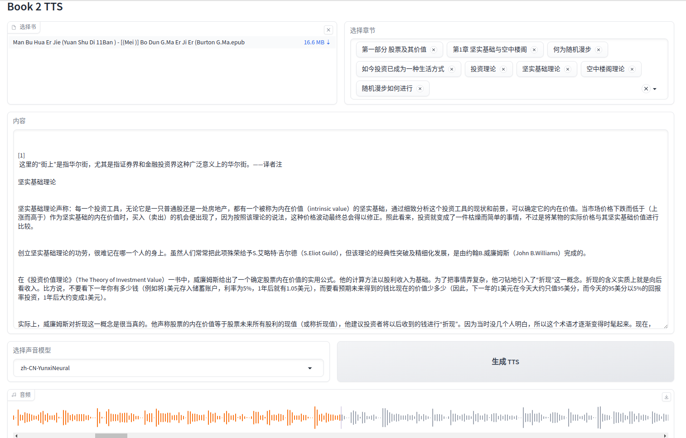

# Book2TTS - 智能有声书制作工具

> 🎧 一个功能强大的书籍转有声书工具，支持 EPUB、PDF 文件转换，具备 AI 文本优化和多种语音合成服务



## ✨ 功能特性

### 📚 支持多种文件格式
- **EPUB 电子书**：自动解析章节目录，支持选择性转换
- **PDF 文档**：支持文本提取和 OCR 识别（含图片文档）
- **灵活的章节选择**：可选择特定章节或页面范围进行转换

### 🎤 多种语音合成服务
- **Microsoft Edge TTS**：免费、高质量的语音合成
- **Azure Cognitive Services**：企业级语音合成服务
- **多种声音选择**：支持不同语言和音色

### 🤖 AI 智能文本处理
- **智能排版优化**：去除页码、注释、标注等干扰内容
- **标点符号补全**：智能补全缺失的标点符号
- **多 LLM 支持**：集成 Google Gemini、Azure OpenAI 等服务
- **自定义提示词**：可自定义文本处理规则

### 🔧 高级功能
- **批量处理**：支持批量转换多个文件
- **音频合并**：自动合并章节音频文件
- **OCR 文字识别**：支持火山引擎 OCR 服务
- **进度监控**：实时显示转换进度和状态
- **Web 界面**：基于 Gradio 和 Django 的友好界面


## 🚀 快速开始

### 环境要求

- Python 3.8+
- FFmpeg（用于音频处理）

### 安装方式

#### 1. 使用 pip 安装

```bash
# 克隆项目
git clone https://github.com/pingfury/book2tts.git
cd book2tts

# 安装依赖
pip install -r requirements.lock

# 或使用 uv（推荐）
pip install uv
uv pip install -r requirements.lock
```

#### 2. 使用 Docker 部署

```bash
# 构建镜像
docker build -t book2tts .

# 运行容器
docker run -p 8000:8000 -v /your/books:/app/books book2tts
```

### 配置环境变量

创建 `.env` 文件并配置必要的服务密钥：

```env
# Azure 语音服务（可选）
AZURE_SPEECH_KEY=your_azure_key
AZURE_SPEECH_REGION=your_region

# Google Gemini API（可选）
GOOGLE_API_KEY=your_gemini_key

# 火山引擎 OCR（可选）
VOLC_ACCESS_KEY=your_volc_ak
VOLC_SECRET_KEY=your_volc_sk
```

## 📖 使用说明

### Web 界面使用

1. **启动服务**：
```bash
# Gradio 界面
python -m book2tts.ui

# Django Web 应用
cd src/web
python manage.py runserver
```

2. **单篇处理**：
   - 上传 EPUB 或 PDF 文件
   - 选择要转换的章节
   - 选择语音合成服务和音色
   - 可选：使用 AI 优化文本内容
   - 开始转换并下载音频文件

3. **批量处理**：
   - 批量上传多个文件
   - 配置统一的转换参数
   - 系统自动排队处理
   - 监控转换进度


### 命令行使用

```bash
# 转换 EPUB 文件
python -m book2tts book_tts example.epub /output/directory

# 合并音频文件
python -m book2tts merge_audio /audio/directory output.wav

# 计算音频总时长
python -m book2tts audio_duration /audio/directory
```

## 🏗️ 架构设计

### 核心模块

- **book2tts/parse.py**：书籍解析和内容提取
- **book2tts/tts.py**：语音合成服务接口
- **book2tts/llm_service.py**：AI 文本处理服务
- **book2tts/storage.py**：文件存储管理
- **book2tts/ui.py**：用户界面入口

### 技术栈

- **后端框架**：Django + Gradio
- **任务队列**：Celery + Redis
- **文档处理**：PyMuPDF, ebooklib, BeautifulSoup4
- **音频处理**：FFmpeg, edge-tts
- **AI 服务**：Google Gemini, Azure OpenAI
- **前端样式**：Tailwind CSS

## 🔧 高级配置

### 自定义文本处理规则

可以通过修改系统提示词来自定义文本处理规则：

```python
CUSTOM_SYSTEM_PROMPT = """
# 自定义文本处理规则
- 保持原始语言
- 去除页码和注释
- 补全标点符号
- 其他自定义规则...
"""
```

### 语音合成配置

支持配置语音参数：

```python
# EdgeTTS 配置
voice_config = {
    "voice": "zh-CN-YunxiNeural",
    "rate": "+0%",
    "volume": "+0%"
}

# Azure TTS 配置
azure_config = {
    "voice": "zh-CN-YunxiNeural",
    "style": "chat",
    "rate": "medium"
}
```

## 📝 开发指南

### 项目结构

```
book2tts/
├── src/
│   ├── book2tts/          # 核心功能模块
│   └── web/               # Django Web 应用
├── requirements.lock      # 生产依赖
├── requirements-dev.lock  # 开发依赖
├── pyproject.toml        # 项目配置
├── Dockerfile            # Docker 配置
└── README.md             # 项目文档
```

### 贡献代码

1. Fork 本项目
2. 创建功能分支：`git checkout -b feature/your-feature`
3. 提交更改：`git commit -am 'Add your feature'`
4. 推送分支：`git push origin feature/your-feature`
5. 提交 Pull Request

## 🔗 相关链接

- **Microsoft Edge TTS**：[edge-tts](https://github.com/rany2/edge-tts)
- **Azure 语音服务**：[Azure Cognitive Services](https://azure.microsoft.com/en-us/services/cognitive-services/speech-services/)
- **Google Gemini**：[Gemini API](https://ai.google.dev/)
- **火山引擎 OCR**：[Volcano Engine](https://www.volcengine.com/)

## 📄 许可证

本项目采用 MIT 许可证，详见 [LICENSE](LICENSE) 文件。

## 🤝 支持

如果您在使用过程中遇到问题，请：

1. 查看 [Issues](https://github.com/pingfury/book2tts/issues) 寻找解决方案
2. 提交新的 Issue 描述问题
3. 联系作者：pingfury@outlook.com

---

⭐ 如果这个项目对您有帮助，请给个 Star 支持一下！
